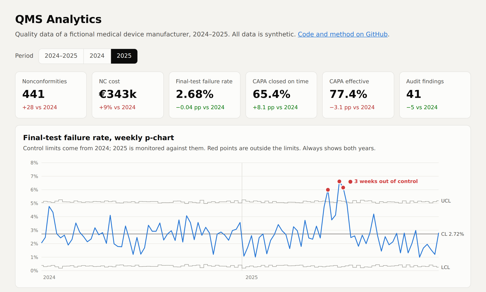

# Matteo Mastropasqua

**Senior Data Analyst · Business Intelligence · Data Quality**
Remote, based in Italy · [LinkedIn](https://www.linkedin.com/in/matteomastropasqua) · [Email](mailto:mastropasquamatteo@gmail.com)

I build reporting that people actually use and numbers that hold up when someone checks them.

## What I do

- **BI in production.** I run about 25 dashboards in Tableau and Power BI, used by around 70 people across Sales, Operations and leadership.
- **Multi-source reconciliation.** Most of my work is making Salesforce, SQL Server, SAP, Jira and the usual pile of Excel files agree with each other, and explaining why they don't when they don't.
- **Quality background.** Before data I spent about 10 years in Quality Assurance on ISO 9001, 14001, 45001 and 13485 systems. I treat data the same way: defined requirements, controls, traceability.

## Projects

<a href="https://mastropasquamatteo.github.io/qms-analytics/">
  <picture>
    <source media="(prefers-color-scheme: dark)" srcset="assets/qms-dashboard-dark.png">
    
  </picture>
</a>

**[Live demo: QMS dashboard](https://mastropasquamatteo.github.io/qms-analytics/)**, an interactive quality dashboard that runs in the browser. Click the image to open it.

| Project | What it shows | Stack |
|---|---|---|
| [revenue-reconciliation](https://github.com/mastropasquamatteo/revenue-reconciliation) | Record-level reconciliation of CRM, ERP and data warehouse revenue. Totals that look fine can hide EUR 965k of offsetting errors. | SQL, Python |
| [qms-analytics](https://github.com/mastropasquamatteo/qms-analytics) | Quality data for an ISO 13485 manufacturer: a p-chart that catches what the yearly KPI missed, Pareto, CAPA effectiveness, audit findings. | SQL, Python, JavaScript |
| [ml-notebooks-2023](https://github.com/mastropasquamatteo/ml-notebooks-2023) | Two end-to-end machine learning notebooks, with a review of what I would do differently today. | Python, scikit-learn |

All project data is synthetic or public. Nothing comes from an employer.

## Stack

| Area | Tools |
|---|---|
| Query & modelling | SQL (SQL Server, T-SQL), SOQL, Power Query (M), DAX |
| BI | Power BI, Tableau (Desktop and Server) |
| Analysis | Python (pandas, Jupyter), Excel |
| Sources I work with daily | Salesforce, SAP, Jira, SQL Server |

## Work with me

Open to data roles and to freelance work on:

- BI dashboards and data models in Power BI or Tableau
- reconciling reports that don't match across systems
- KPI and reporting for ISO-certified quality management systems
